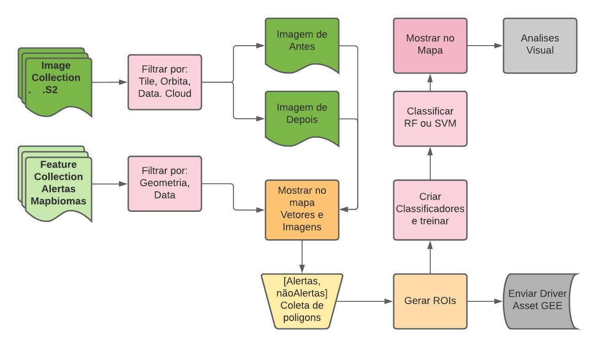

# Routeiro de classificação de imagens orbitais _Geodatin

* Tópicos:
    + Apresentação da plataforma de Google Earth Engine (teórico/práctico)
    + Distribuição das áreas de coleta (prático)
    + Coleta de amostras (teórico/práctico)
    + Análises espectrais do fenómeno de desmatamento (teórico/práctico)
    + Apresentação do processo de classificação em ML dentro do GEE (teórico/práctico)

### Fluxograma do processo de coleta de amostras

fluxograma: 

Um exemplo do scripts de coleta pode ser visualizado e copiado desde: 
> https://code.earthengine.google.com/eef6d7dd79457ba41c04a081c3e94e89

este repositorio segue um routeiro de analises de dados satelitais e classificação utilizando python e Google Earth Engine